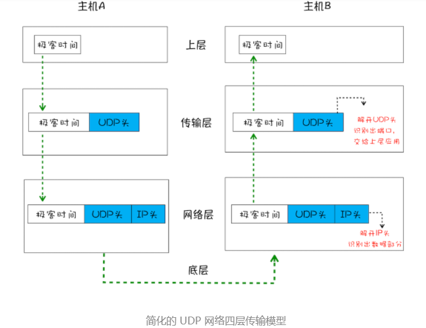
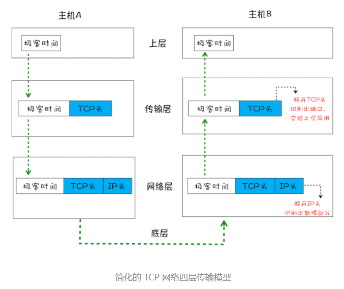
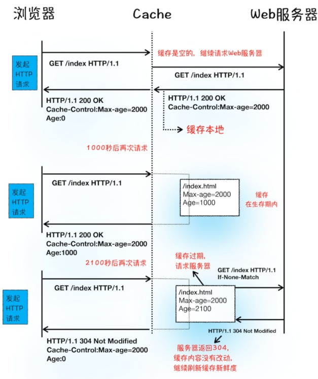

### 1.最新的 Chrome 浏览器包括：1 个浏览器（Browser）主进程、1 个 GPU 进程、1 个网络（NetWork）进程、多个渲染进程和多个插件进程。
- **浏览器进程**主要负责界面显示、用户交互、子进程管理，同时提供存储等功能。
- **渲染进程**核心任务是将 HTML、CSS 和 JavaScript 转换为用户可以与之交互的网页，排版引擎 Blink 和 JavaScript 引擎 V8 都是运行在该进程中，默认情况下，Chrome 会为每个 Tab 标签创建一个渲染进程。出于安全考虑，渲染进程都是运行在沙箱模式下。
- **GPU 进程**其实，Chrome 刚开始发布的时候是没有 GPU 进程的。而 GPU 的使用初衷是为了实现 3D CSS 的效果，只是随后网页、Chrome 的 UI 界面都选择采用 GPU 来绘制，这使得 GPU 成为浏览器普遍的需求。最后，Chrome 在其多进程架构上也引入了 GPU 进程。
- **网络进程**主要负责页面的网络资源加载，之前是作为一个模块运行在浏览器进程里面的，直至最近才独立出来，成为一个单独的进程。
- **插件进程**主要是负责插件的运行，因插件易崩溃，所以需要通过插件进程来隔离，以保证插件进程崩溃不会对浏览器和页面造成影响。

### 2.线程与进程
- 线程：启动与管理，线程依附于进程
- 进程：程序运行的实例，操作系统为该程序创建的一块内存存放代码

原始类型数据会被存储到**栈空间**，引用类型会被存储到**堆空间**

### 3.页面文件如何被完整送达浏览器
数据包在互联网上传输需要符合网际协议(IP)，访问任何网站实际上是你的计算机向另一台计算机请求信息。

**简化IP网络传输模型为三层：上层、网络层、底层**
上层将有“xx”数据包交给-->网络层，网络层将IP投附加到数据包上形成新的IP数据包，并交给-->底层，底t层通过物理网络层将数据传输给主机，-->抵达后主机在网络层拆开数据包的IP头信息，-->并将拆开的数据提交给上层

IP是非常底层的协议，只负责把数据包传送到对方电脑，但是对方电脑并不知道把数据包交给哪个程序，需要基于IP之上开发能和应用打交道的协议，最常见的是User Datagram Protocol--用户数据包协议

IP通过Ip地址信息把数据包发送给指定电脑，UDP通过端口号将数据包发送给正确的程序，端口号会被装进UDP头中

拆解UDP头、填装UDP头都是在传输层进行

**UDP存在的问题**

UDP发送数据时候，不提供重发机制，只会丢弃当前的包，发送后也无法指定能否抵达目的地，虽然不能保证数据可靠性，但是数据传输速度却非常快，应用于在线视频、互动游戏

大文件会被拆分成多个数据小包传输，小包数据由不同路由，不同时间抵达收货处，无法将这些数据还原成完整的文件

**TCP**
针对数据包丢失TCP提供重传机制，引用数据包排序机制，将乱序组合为完整文件

TCP包含建立链接、传输数据、断开链接三个阶段

TCP提供面向连接，指数据通信前做好两端间的准备工作
三次握手，建立TCP连接时，客户端和服务器总共发送三个数据包确认连接 
客户端到服务器通过三次握手

传输数据阶段，接收端对每个数据包进行缺人操作，接收端在接受数据后发送确认收到的消息给发送端，发送端发送数据包后再规定时间内没有收到接受端反馈的缺人消息，判定数据包丢失，触发重发机制，大文件传输过程中被拆分为很多小的数据包，数据包抵达接收端后，接收端按照TCP体验中序号为其排序，一遍组成完整数据，数据包输送完毕，四次挥手保证双方断开连接，

TCP为了保证数据传输可靠性，牺牲数据包传输的速度，三次握手、数据包校验将数据包数量提升了一倍

### 4.为什么有的网站第二次打开会很快
浏览器发送HTTP请求之前会在浏览器缓存中查询是否有要请求的文件，有就会拦截请求
Chrome默认一个域名简历6个tcp连接，
请求头中加入了`Connection:Keep-Alive ` TCP连接发送后仍然保持打开状态，省去下次请求需要建立 的时间

回到正题
请求头中Cache-Control:Max-age=2000，Max-age为缓存时间，
If-None-Match:"4f80f-13c-3a1xb12a"发送到服务器判断资源是否更新
很多网站第二次访问能够秒开，是因为这些网站把很多资源都缓存在了本地，DNS 数据也被浏览器缓存了，这又省去了查询DNS 环节。
### 5.DNS是什么
Domain Name System
网站IP为180.101.49.12 在使用中很难记忆，实际输入www.baidu.com，由DNS将域名映射到IP.
### 6. 登录状态是如何保持的？
- 填入的用户信息通过post提交到服务器，
- 服务器接收后查验信息是否正确，正确生成用户身份字符串，填入在响应头的Set-cookie字段，将其发送给客户端，
- 客户端将Set-cookie:lalal 字段信息存本地
- 用户再次访问发起请求，请求头中会携带Cookie:lalal像服务器发请求
- 服务器发现这条请求里有lalal字样，判定为已登录

### 7.http请求从发起到结束经历了8个阶段
构建请求--》查找缓存--》准备IP和端口--》等待TCP队列--》建立TCP连接--》发起HTTP请求--》服务器处理请求--》服务器返回请求--》断开连接
### 8.在浏览器里，从输入 URL 到页面展示，这中间发生了什么？