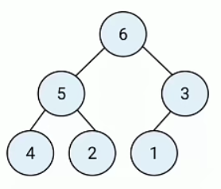
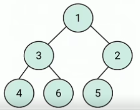
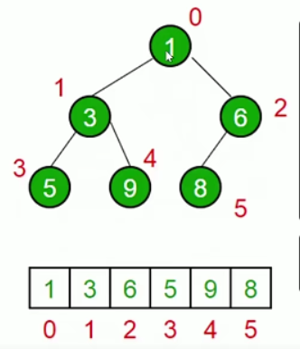
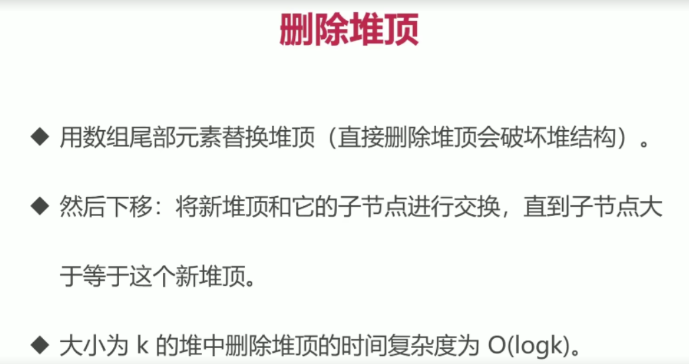

### 堆是一种特殊的完全二叉树，要把整个树填满

所有节点都大于等于或小于等于子节点

js 用数组表示堆

左侧子节点位置是 `2*index +1`

右侧子节点位置是 `2*index +2`

父节点位置 `(index-1)/2 //取整`

### 堆的应用
快速找到最大值、最小值
时间复杂度 O(1)

找出第 k 个最大(小)元素
构建一个最小堆并将元素一次插入堆中
当堆的容量超过k就删除堆顶
插入结束后堆顶就是第k个最大元素

### 实现最小堆
在类里声明数组，装元素，插入、删除、获取堆顶、获取堆大小

插入底部，上移，直到父节点小于等于这个插入的值，
大小为k的堆中插入元素的时间复杂度为O(logk)

删除堆顶

获取堆顶和堆大小
获取堆顶：返回数组头部
获取堆顶大小：返回数组长度