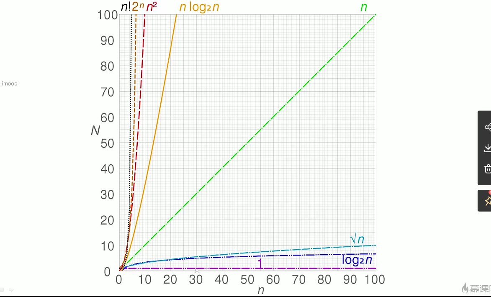

### 时间复杂度

从1这根紫线开始往上看

```js
let i = 0
i+=1
//时间复杂度o(1),只执行一次
```

```js
for(let i=0;i<n;i++){
  console.log(i)
}
//时间复杂度o(n)
```

```js
let i = 0
i+=1
for(let i=0;i<n;i++){
  console.log(i)
}
//时间复杂度o(1)+o(n)//取大o(n)

```

```js
for (let i = 0; i < n; i++) {
  for (let j = 0; j < n; j++) {
    console.log(i, j)
  }
}
//时间复杂度o(n)*o(n)=o(n^2)
```
O(logN)2的多少次方是N
```js
let i=1
while(i<n){
  console.log(i)
  i*=2
}
//时间复杂度O(logN)
```
[O(logN)解释](https://blog.csdn.net/weixin_43866211/article/details/107976440)

### 空间复杂度
占用的储存空间

```js
let i = 0
i+=1
//空间复杂度o(1),只执行一次
```
声明了单个变量

```js
let list = []
for(let i=0;i<n;i++){
  list.push(i)
}
//空间复杂度o(n)
```

```js
let matrix = []
for (let i = 0; i < n; i++) {
  matrix.push(i)
  for (let j = 0; j < n; j++) {
    matrix.push(j)
  }
}
//空间复杂度o(n)*o(n)=o(n^2)
```