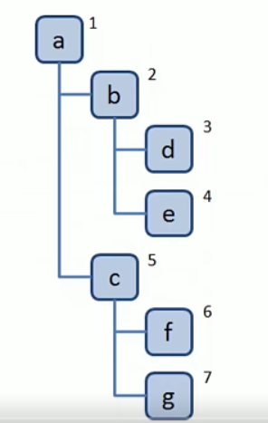
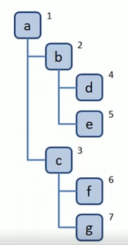
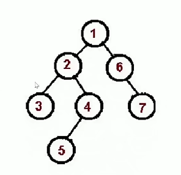
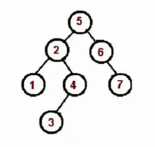
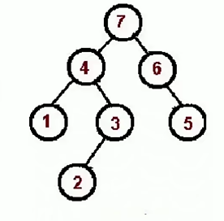

### 深度优先遍历(dfs)：尽可能深的搜索树的分支

口诀：访问根节点，对根节点 children 挨个进行深度优先遍历，递归

[代码链接](./树.js)

### 广度优先遍历(bfs)：先访问离根节点最近的节点

口诀：

1.新建队列，将根节点入队

2.队头出队并访问 -

3.队头 children 挨个入队

4.重复 2、3，直至队列为空

[代码链接](./树.js)

### 二叉树:树中每个节点最多只能有两个子节点，js 通常使用 object 来模拟二叉树

类似深度遍历

- **先序遍历**

访问根节点

对根节点的左子树进行先序遍历

对根节点的右子树进行先序遍历

- **中序遍历**
  对根节点左子树进行遍历
  访问根节点
  对根节点右子树进行中序遍历

- **后序遍历**
  对根节点左子树进行遍历
  对根节点右子树进行中序遍历
  访问根节点

栈：后进先出
